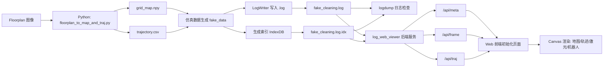
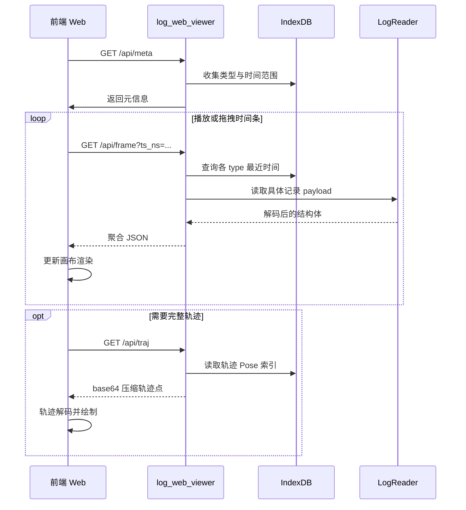
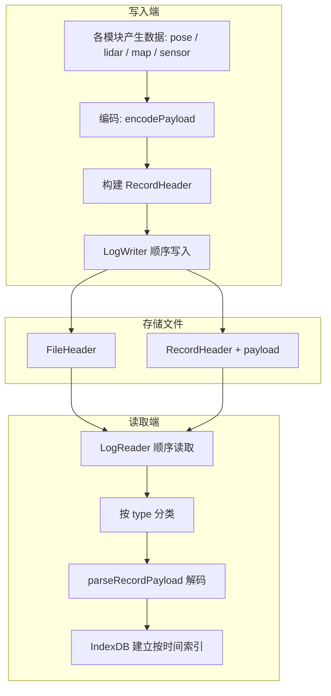
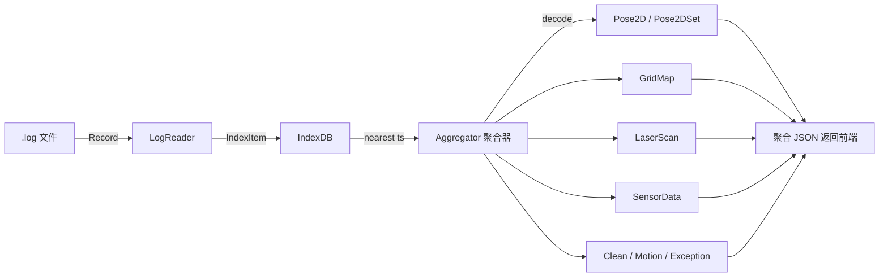

# Logtool 数据流流程图

本文件描述 Logtool 从数据生成、日志写入、索引建立、到 Web 可视化回放的整体数据流。

---

## 1. 总体数据流

---

## 2. 运行时数据流（Web 回放路径）

---

## 3. .log 文件内部数据流

---

## 4. 核心 API 数据结构流向

---

以上四个图涵盖：

- 仿真生成链路
- 日志文件内部流转
- Web API 调用序列
- 数据结构聚合关系

可直接嵌入到项目 `docs/` 或 README 中使用。
